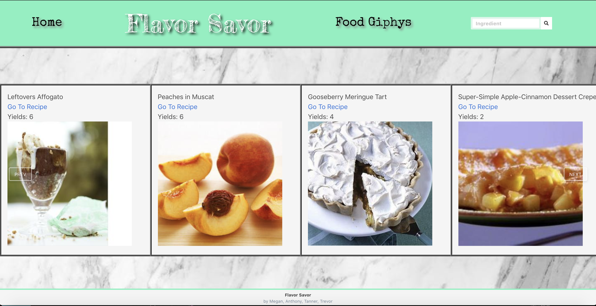
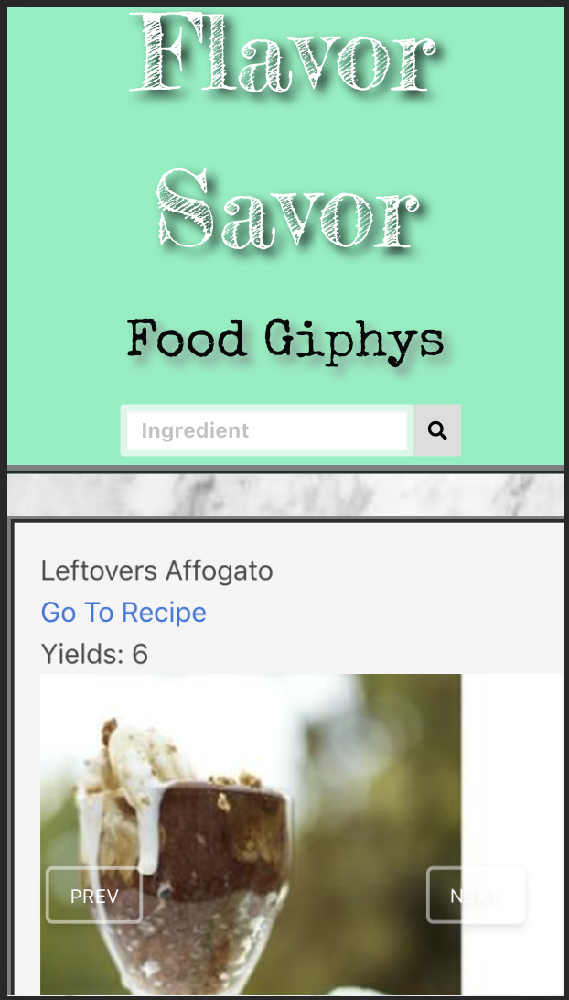

# <strong>Flavor Savor

In this project our team created a web based app called Flavor Savor that finds a recipe based on what food item the user inputs and it displays a number of recipes

 

## <strong> Usage of the App <strong>
* Opens to a display of featured recipes
* Search a desired ingredient
    * displays recipes that include the desired ingredient
* Click on the Food Giphys tab
    * displays giphys

 

The following image demonstrates on the computer:

 

The following image demonstrates on the mobile:

 

## <strong> Technology Used:
* HTML
* CSS
* Bulma
* JavaScript/jQuery
* Giphys api
* Edamam api 
* Glide.js

 

Find some delicious recipes: [Flavor Savor](https://meganlcoppins.github.io/Flavor-Savor/)

